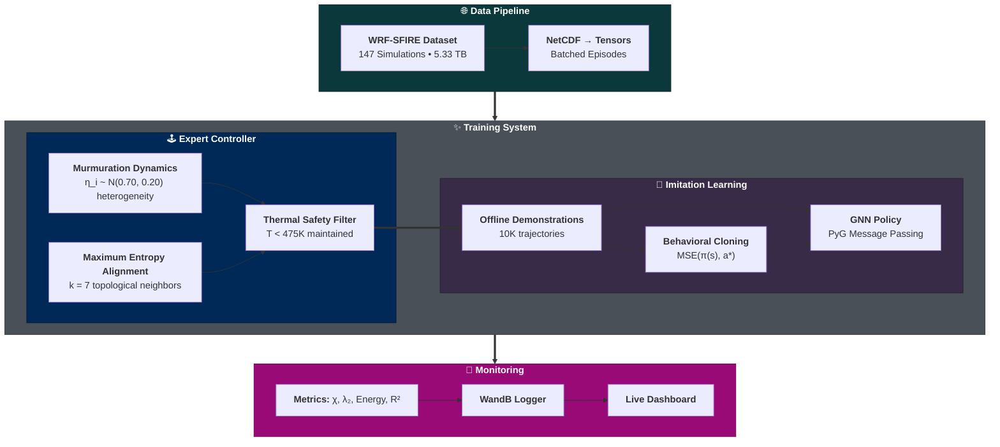

<div align="center">

# 🔥 Thermur

### *Teaching Drone Flocks to See Fire Like Starlings See Hawks*

[](https://www.python.org/downloads/)
[](https://pytorch.org/)
[](https://lightning.ai/)
[](https://github.com/mit-ll-responsible-ai/hydra-zen)
[](https://wandb.ai/Thermur/thermur-imitation/workspace)
[](https://opensource.org/licenses/MIT)

</div>

---

## 🚀 Quick Start

Get Thermur running in under a minute:

```bash
# Install from PyPI
pip install thermur

# Start training (auto-downloads sample data on first run)
thermur train

# Monitor training progress in real-time
thermur monitor  # Opens WandB dashboard
```

---

## 🐦‍⬛ The Biological Inspiration

I've spent countless hours watching starling murmurations since my childhood in Western Massachusetts. During winter breaks from school, I'd walk through snow-covered fields at dusk, when thousands of starlings would gather before roosting. I still have a vivid memory from when I was about nine, watching a hawk cut through the flock directly overhead. What struck me wasn't just the synchronized beauty of their flight, but how instantly they transformed when threatened. The smooth, flowing patterns shattered into chaotic motion, with sharp directional changes and an even tighter ink-like density that painted the sky black wherever they went. Most remarkably, I could instinctively track the hawk's position by watching these ripples of disorder move through the flock.

**The invisible predator became visible through the birds' collective response.**

### From Tragedy to Technology

On June 30, 2013, nineteen members of the Granite Mountain Hotshots were fatally overtaken by the Yarnell Hill Fire [^1]. The crew's lookout had lost visual contact, and by the time the fire's convective plume reappeared, its lethal speed and direction left no time for escape. That incident, my own visit to the entrapment site, and the ever-increasing incidence of destructive wildfires have profoundly shaped my perspective. They underscore an ethical obligation to orient my work in machine learning directly toward preventing this kind of tragedy.

What's fundamentally challenging about firefighter entrapments like these [^2] is that the most critical information on a fireground—the instantaneous, localized flow of heat and air—is dangerously invisible. Anemometers provide numbers, but the human brain is wired for something far more primitive and powerful: the perception of coherent motion [^3]. Classic studies have shown that we can recognize complex activity from just a few moving points of light, a phenomenon known as "biological motion" perception [^4].

### The Biomimetic Insight

What if wildfire could be recast as the "predator" in this biological system? Could we create a flock of robots that responds to thermal threats the way starlings react to a predator? Could we model their movement, measure their cohesion, and coordinate their alignment within the context of their flock [^5]? And most critically, could this system translate an invisible threat into a visual language that firefighters could intuitively understand?

**Thermur** (a portmanteau of "thermal" and "murmuration") was born from this biomimetic insight. With modern micro-robotics now capable of surviving brief excursions up to 475K [^6], we can finally implement a system where:

> *A flock of robots, governed by the mathematical rules of a starling flock responding to a predator [^7], learns to move in such a way that it not only survives the thermal chaos of a wildfire but also translates that chaos into a dynamic visual display that is immediately legible to a human under pressure.*

---

## 🏗️ Technical Architecture

Thermur orchestrates biomimetic flocking through a sophisticated machine learning pipeline that combines physics-based control with neural network policies:

### Core Technology Stack

| Component | Technology | Purpose |
|-----------|------------|---------|
| **Configuration** | [Hydra-zen](https://github.com/mit-ll-responsible-ai/hydra-zen) + [Pydantic](https://pydantic.dev/) | Composable configs with runtime validation and type safety |
| **Training** | [PyTorch Lightning](https://lightning.ai/) | Distributed training orchestration with automatic mixed precision |
| **Environment** | [PyTorch Geometric](https://pytorch-geometric.readthedocs.io/) | Offline trajectory generation with WRF-Fire data |
| **Policy Network** | [PyTorch Geometric](https://pytorch-geometric.readthedocs.io/) | Graph Neural Networks for topological neighbor interactions |
| **CLI** | [Typer](https://typer.tiangolo.com/) + [Rich](https://rich.readthedocs.io/) | Beautiful terminal interface with fire gradient effects |
| **Monitoring** | [Weights & Biases](https://wandb.ai/) | Real-time metrics ([view project](https://wandb.ai/Thermur/thermur-imitation/workspace)) |

### System Architecture



### Core Scientific Contributions

1. **Heterogeneous Behavioral Variance**: Individual noise amplitudes drawn from $`\eta_i \sim N(\mu=0.33, \sigma=0.20)`$ create the behavioral heterogeneity necessary for critical state dynamics. Based on the framework from [^8] with an optimized mean value, this continuous spectrum of responses, ranging from strongly aligning agents with low $`\eta_i`$ to weakly aligning agents with high $`\eta_i`$, maintains elevated susceptibility $`\chi \sim N`$ [^9] and enables the scale-free correlations observed in natural murmurations [^10].

2. **Topological Interactions**: Each agent responds to exactly $`k=7`$ nearest neighbors regardless of distance, matching empirical observations of starling behavior [^11] and enabling scale-free information transfer with propagation speeds of 15-45 m/s [^12].

3. **Thermal Safety Constraints**: Smooth penalty-based safety using the Kreisselmeier-Steinhauser formulation [^13], ensuring agents avoid thermal limits ($`T < 475K`$) through gradient-based corrections that integrate seamlessly with neural network training.

4. **Graph Neural Networks**: Permutation-equivariant architecture [^14] that naturally handles dynamic flock topologies through message-passing on k-nearest neighbor graphs, implemented with PyTorch Geometric [^15].

---

## 📐 Mathematical Framework

The system bridges biological observation with robotic control through a unified theorem that maintains critical state dynamics while guaranteeing thermal safety. For complete derivations, see [`docs/mathematical-framework.md`](docs/mathematical-framework.md).

### Unified Murmuration Control Theorem

Natural starling flocks achieve near-instantaneous information propagation through a delicate phase transition between order and disorder. We engineer this criticality through heterogeneous behavioral variance, where individual noise amplitudes $`\eta_i \sim N(\mu, \sigma=0.20)`$ create a continuous spectrum of responses [^8]. This heterogeneity, wherein some agents strongly align while others move more independently, generates the variance necessary for scale-free correlations.

Given $`N`$ agents with positions $`\mathbf{x}_i \in \mathbb{R}^3`$ and velocities $`\mathbf{v}_i \in \mathbb{R}^3`$, the control law:

$`
\hspace{0.5cm} \displaystyle
\mathbf{u}_i^* = \mathbf{u}_i^{\text{nom}} - \kappa \cdot \nabla T \cdot \sigma(-\rho c)
`$  
<br>

where the nominal control orchestrates multiple biologically-inspired components:

$`
\begin{aligned}
\mathbf{u}_i^{\text{nom}} = &\underbrace{-\frac{4\lambda}{v_0^6}(|\mathbf{v}_i|^2 - v_0^2)^3\mathbf{v}_i + \eta_i \boldsymbol{\xi}_i}_{\text{Quartic speed confinement [^16]}} + \underbrace{\sum_{j \in \mathcal{N}_k(i)} J_{ij} (\mathbf{v}_j - \mathbf{v}_i)}_{\text{Maximum entropy alignment [^17]}} \\
&- \underbrace{\gamma_{\text{sep}} \sum_{r_{ij} < r_{\text{min}}} \frac{\mathbf{r}_{ji}}{r_{ij}^3}}_{\text{Separation}} - \underbrace{\beta\nabla T + D\nabla\rho(1+2\theta_i)}_{\text{Environmental response}}
\end{aligned}
`$  
<br>

### The Mechanism of Criticality

In bird flocks, individuals exhibit varying degrees of alignment with their neighbors, creating a natural heterogeneity in the system. We model this through individual noise amplitudes drawn from a Gaussian distribution $`\eta_i \sim N(\mu, \sigma=0.20)`$, which enables continuous phase transitions [^8].

Agents with low noise amplitudes strongly align with their neighbors, while those with high amplitudes move more independently. This continuous spectrum of behaviors rather than discrete states creates the variance necessary for critical dynamics. The resulting susceptibility $`\chi`$ scales with flock size $`N`$, confirming the system remains at criticality without requiring explicit anti-alignment mechanisms.

Each agent watches exactly 7 nearest neighbors regardless of distance [^11]. This "topological" rule means information spreads the same way whether the flock is spread out or compressed, enabling rapid response across the entire group.

### Speed Regulation Through Marginal Confinement

Natural flocks maintain remarkably stable cruising speeds despite constant interactions and perturbations. Cavagna et al. [^16] discovered this emerges from "marginal speed confinement," wherein agents experience minimal resistance near their preferred speed but strong forces prevent extreme deviations. This quartic potential approach resolves a fundamental conflict in collective behavior, since it allows natural speed fluctuations necessary for information transfer while preventing the flock from dispersing or stalling. 

Our implementation uses this biologically-validated mechanism instead of artificial damping, ensuring agents achieve their full cruising speed of 11.1 m/s rather than being artificially capped at lower velocities.

### Density Waves and Thermal Response

When starlings detect a hawk, waves of movement ripple through the flock at speeds of 15-45 m/s [^12], much faster than any individual bird flies. These waves create dark bands that look like ink spreading through water. We reproduce this effect using reaction-diffusion equations, where crowding in one area causes neighboring regions to spread out, creating visible waves.

When the flock encounters high temperatures, these density waves combine with temperature gradient following. The result is a flock that flows away from heat while the density waves make the danger visible through the pattern of movement.

### Safety Guarantees

The thermal safety system uses smooth Kreisselmeier-Steinhauser penalties to guide agents away from dangerous temperatures [^13]. The gradient-based corrections create a continuous force field that intensifies near thermal boundaries, ensuring agents naturally avoid excessive heat without requiring optimization solvers.

This guarantees agents never exceed 475 K, the maximum safe temperature for the hardware. Unlike rule-based systems that might fail in unexpected situations, this mathematical approach ensures safety in all conditions.

### Emergent Properties

The unified control law produces emergent dynamics that match biological flocks without explicit programming. These properties arise naturally from the interplay between heterogeneous coupling, topological interactions, and active matter dynamics [^18]:

- **Critical State**: Maintained through heterogeneous noise $`\eta_i \sim N(\mu, \sigma=0.20)`$ creating behavioral variance
- **Rapid Response**: Information propagates at 15-45 m/s through topological networks
- **Scale-Free Dynamics**: Velocity correlations follow $`C(r) \sim r^{-1/3}`$ across all flock sizes
- **Robust Cohesion**: Topological interactions with k=7 neighbors ensure connectivity
- **Thermal Safety**: Smooth penalties maintain $`T < 475`$ K through gradient corrections

These emergent behaviors are verified through the comprehensive metrics suite described in [Monitoring & Metrics](#5-monitoring--metrics), ensuring the trained policy preserves the expert controller's critical dynamics.

---

## 💻 Command-Line Interface

Thermur provides an elegant CLI built with [Typer](https://typer.tiangolo.com/) and [Rich](https://rich.readthedocs.io/) for beautiful terminal output:

### Core Commands

```bash
thermur --help  # Shows all available commands with emoji icons
```

| Command | Description | Key Options |
|---------|-------------|-------------|
| `info` | 📋 Display system and configuration information | - |
| `monitor` | 🎨 Open [WandB dashboard](https://wandb.ai/Thermur/thermur-imitation) in browser | - |
| `runs` | 🏃 Explore training runs and configurations | `list`, `show`, `compare`, `clean` |
| `train` | 🚀 Train the thermal drone flock using imitation learning | `--dry-run`, `--force`, `--name`, `--resume` |
| `validate` | ✅ Validate system setup and configuration | `--config` |

### Training Workflow

The `train` command supports both interactive and non-interactive modes:

```bash
# Interactive mode (default) - prompts for configuration
thermur train

# Named training run (auto-downloads sample if needed)
thermur train --name my-experiment

# Resume from last checkpoint
thermur train --resume last

# Resume from specific checkpoint
thermur train --resume checkpoints/epoch5.ckpt

# Non-interactive mode with Hydra overrides
thermur train --no-interactive \
              controller.mmm.heterogeneity_std=0.25 \
              controller.mmm.k_neighbors=7 \
              training.optimizer.learning_rate=0.001

# Dry run to validate configuration without training
thermur train --dry-run
```

### Configuration System

Thermur uses [Hydra-zen](https://github.com/mit-ll-responsible-ai/hydra-zen) with [Pydantic](https://pydantic.dev/) validation for type-safe configuration management:

```bash
# Standard override syntax
thermur train training.optimizer.learning_rate=0.001   # Set value
thermur train +training.architecture.new_param=42      # Append new parameter
thermur train ++training.architecture.force_param=true # Force add/override
thermur train ~training.architecture.remove_param      # Remove parameter

# Combining multiple overrides
thermur train controller.mmm.agent_count=50 \
              training.hardware.accelerator=gpu \
              training.optimizer.max_epochs=100
```

### Run Management

Explore and manage training experiments with the `runs` subcommand:

```bash
# List recent training runs with status
thermur runs list               # Shows 10 most recent
thermur runs list --all         # Shows all runs
thermur runs list -n 20         # Shows 20 most recent

# Show detailed configuration for a run
thermur runs show last          # Most recent run
thermur runs show last2         # Second most recent
thermur runs show run-id        # Specific run by ID

# Compare configurations between runs
thermur runs compare            # Compare last 2 runs
thermur runs compare run1 run2  # Compare specific runs

# Clean up old runs
thermur runs clean --keep 5  # Keep only 5 most recent
```

### System Validation

Before training, validate your setup:

```bash
# Full system validation
thermur validate

# Validate with config overrides
thermur validate controller.mmm.agent_count=100

# Display system information
thermur info
```

All training runs are automatically logged to our [WandB project](https://wandb.ai/Thermur/thermur-imitation/workspace) for collaborative monitoring and analysis.

---

## 🦾 Data Pipeline & Training

### WRF-SFIRE Dataset

The training data comes from 147 high-resolution wildfire simulations (5.33 TB total) generated using WRF-Fire [^19]:

| Parameter | Range | Description |
|-----------|-------|-------------|
| **Wind Speed** | 3-12 m/s | Initial wind conditions |
| **Fuel Type** | 13 categories | Anderson fuel models [^20] |
| **Domain** | 40m resolution | LES with 4m fire mesh |
| **Duration** | 20-30 minutes | Full plume development |
| **Temperature** | Up to 600K | Includes extreme heating |

### Data Management

Thermur automatically manages training data:

```bash
# Sample data (1.5GB) downloads automatically on first run
thermur train

# For full WRF-SFIRE dataset (5.3TB, 147 simulations):
# 1. Download NetCDF files from the Globus endpoint
# 2. Place them in data/raw/
# 3. Training will automatically discover and use them
```

For details on the WRF-SFIRE dataset and data procurement, see [`docs/data-procurement.md`](docs/data-procurement.md).

### Training Workflow

The imitation learning pipeline leverages [PyTorch Lightning](https://lightning.ai/) for training orchestration and [PyTorch Geometric](https://pytorch-geometric.readthedocs.io/) for graph-based learning:

#### 1. Expert Trajectory Generation

The physics-based controller generates optimal trajectories using [Pydantic](https://pydantic.dev/)-validated configuration:

```python
from thermur.imitation.controller import MurmurationController, ThermalPenalty
from config.imitation.controller  import MurmurationModel, SafetyModel

# Create thermal safety filter
safety  = SafetyModel(
    ks_kappa         = 100.0,  # Penalty weight
    ks_rho           = 30.0,   # Sharpness parameter
    max_temperature  = 475.0,  # Critical threshold [K]
    thermal_alpha    = 2.5     # Convergence rate
)
penalty = ThermalPenalty(safety)

# Expert maintains critical state through heterogeneous noise
expert = MurmurationController(
    mmm     = MurmurationModel(
        agent_count         = 30,    # Number of agents in flock
        communication_range = 50.0,  # Metric interaction radius
        heterogeneity_mean  = 0.33,  # Mean noise amplitude μ
        heterogeneity_std   = 0.20,  # Noise heterogeneity σ
        j_base              = 1.6    # Uniform coupling strength J₀
        k_neighbors         = 7,     # Topological interaction
    ),
    penalty = penalty,
    safety  = safety
)
```

#### 2. Behavioral Cloning with GNN

The [PyTorch Geometric](https://pytorch-geometric.readthedocs.io/) GNN learns from expert demonstrations:

```python
from thermur.imitation.training.policy import GNNPolicy
from torch_geometric.nn                import GCNConv

class GNNPolicy(LightningModule):
    def __init__(
        self,
        architecture : ArchitectureModel,
        metrics      : MetricsFactory,
        optimizer    : Callable[..., Optimizer],
        scheduler    : Callable[..., LRScheduler]
    ):
        super().__init__()
        # Build GNN layers with PyTorch Geometric
        dim, n = architecture.hidden_dim, architecture.num_layers
        layers = lambda m: ModuleList([m(dim, dim) for _ in range(n)])

        self.activation = getattr(nn, architecture.activation)()
        self.convs      = layers(GCNConv)
        self.decoder    = Linear(dim, 3)     # 3D actions
        self.encoder    = Linear(13, dim)    # Node features
        self.grus       = layers(GRUCell)

    def training_step(self, batch, batch_idx):
        # Behavioral cloning loss
        actions_pred = self(batch)
        loss = mse_loss(actions_pred, batch.action)
        self.log("train/loss", loss)
        return loss
```

#### 3. Dataset Generation

Using [PyTorch Geometric](https://pytorch-geometric.readthedocs.io/) for efficient graph-based learning from offline trajectories:

```python
from torch_geometric.data           import Data, InMemoryDataset
from torch_geometric.data.lightning import LightningDataset

class ExpertDataset(InMemoryDataset):
    ...

    def process(self):
        # Generate expert trajectories using stratified sampling across snapshots
        self.generator.wrf.load_datasets(self.raw_paths)

        trajectory_frames  = int(
            self.trajectory_duration / self.generator.physics.timeframe
        )
        n_snapshots        = self.generator.wrf.n_snapshots
        total_trajectories = n_snapshots * self.trajectories_per_snapshot

        data_list = []
        for snapshot_idx in range(n_snapshots):
            for _ in range(self.trajectories_per_snapshot):
                # Each trajectory uses consistent environmental conditions
                trajectory = self.murmuration.generate_trajectory(
                    generator    = self.generator,
                    num_frames   = trajectory_frames,
                    snapshot_idx = snapshot_idx
                )
                # Each trajectory is list of Data(x=[N,13], action=[N,3], edge_index=[2,E])
                data_list.extend(trajectory)

        self.save(self.collate(data_list), self.processed_paths[0])

    @classmethod
    def as_lightning_datamodule(
        cls,
        batch_size  : int,
        controller  : DictConfig,
        environment : DictConfig,
        generator   : TrajectoryGenerator,
        hardware    : HardwareModel,
        murmuration : MurmurationController,
        train_split : float,
        ui          : ThermurUI
    ) -> LightningDataset:
        # Create dataset with all necessary components for generation
        dataset = cls(
            controller                = controller,
            environment               = environment,
            generator                 = generator,
            murmuration               = murmuration,
            sample_url                = environment.dataset.sample_url,
            trajectories_per_snapshot = environment.dataset.trajectories_per_snapshot,
            trajectory_duration       = environment.dataset.trajectory_duration,
            ui                        = ui
        )

        # Random train/val split with PyG's index_select
        train_size = int(len(dataset) * train_split)
        indices    = torch.randperm(len(dataset))

        return LightningDataset(
            batch_size    = batch_size,
            num_workers   = hardware.num_workers,
            pin_memory    = hardware.pin_memory,
            train_dataset = dataset.index_select(indices[:train_size]),
            val_dataset   = dataset.index_select(indices[train_size:])
        )
```

#### 4. Safety Validation with Thermal Penalties

Every control command passes through the [QPTh](https://github.com/locuslab/qpth)-based safety filter:

```python
# Thermal constraint: c(x,u) = ∇T·u + α(T_max - T) ≥ 0
# Solved as QP: min ||u - u_nom||² s.t. ḣ(x,u) ≥ -α·h(x)
u_safe = cbf_filter.filter(flock_state, u_nominal)
```

#### 5. Monitoring & Metrics

Track training progress in our [WandB workspace](https://wandb.ai/Thermur/thermur-imitation/workspace). The comprehensive metrics suite evaluates both imitation learning performance and preservation of emergent flocking behaviors:

**Imitation Learning Metrics:**

- **Acceleration**: Tracks average control effort to ensure physically plausible forces

- **MAE/RMSE/R²**: Measure how accurately the policy reproduces expert actions, with MAE < 1.0 m/s² indicating excellent imitation

- **Velocity**: Monitors mean flight speed remains realistic (9-12 m/s for starlings [^21])

**Emergent Behavior Metrics:**

- **Effective Energy $`E = -\sum J_{ij} \mathbf{s}_i \cdot \mathbf{s}_j`$**: Tracks the maximum entropy energy function with uniform coupling, where behavioral variance from heterogeneous noise drives phase transitions.

- **Fiedler Value $`\lambda_2`$**: Quantifies algebraic connectivity via the second smallest eigenvalue of the graph Laplacian, computed efficiently using adaptive Lanczos iteration. Positive values ensure flock cohesion.

- **Noise Heterogeneity**: Monitors variance in individual noise amplitudes to maintain critical dynamics

- **Scale-Free Correlation**: Verifies velocity correlations follow the power law $`C(r) \sim r^{-1/3}`$ characteristic of natural murmurations through binned correlation analysis.

- **Susceptibility $`\chi`$**: Measures collective responsiveness through integrated velocity correlations. In critical systems, $`\chi`$ scales with flock size $`N`$ without saturation, enabling rapid information transfer [^10] [^9].

**Dynamic Response Metrics:**

- **Clustering Coefficient**: Measures local neighborhood cohesion via ratio of closed triangles to possible triangles

- **Orientation Coherence**: Quantifies alignment via polarization order parameter $`\Phi = |\sum_i \hat{\mathbf{v}}_i|/N`$

- **Orientation Wave**: Detects density waves by measuring spatial gradients in heading angles (0.15-0.40 rad/m during murmurations)

- **Thermal Reactivity**: Quantifies collective threat response via velocity-temperature spatial correlation

**Safety Metrics:**

- **Temperature**: Average thermal exposure across the flock

- **Thermal Violations**: Minimized through smooth penalty corrections

---

## 🔧 Installation & Development

### System Requirements

- **Python**: 3.13 or higher
- **CUDA**: 11.8+ for GPU acceleration (optional but recommended)
- **Memory**: 16GB RAM minimum, 32GB recommended
- **Storage**: 1.5GB for sample data, 6TB for full dataset
- **OS**: Linux, macOS, or Windows with WSL2

### Installation with uv

This project uses [uv](https://github.com/astral-sh/uv) for dependency management with a lock file ensuring reproducible builds:

```bash
# Install uv (if not already installed)
curl -LsSf https://astral.sh/uv/install.sh | sh

# Clone the repository
git clone https://github.com/Jybbs/Thermur.git
cd Thermur

# Create virtual environment and sync dependencies
uv venv
source .venv/bin/activate  # On Windows: .venv\Scripts\activate
uv sync

# The project is now installed in development mode
```

### Alternative Installation

If you prefer using pip directly:

```bash
# Clone the repository
git clone https://github.com/Jybbs/Thermur.git
cd Thermur

# Create virtual environment
python -m venv .venv
source .venv/bin/activate

# Install in development mode
pip install -e .
```

### Post-Installation Setup

```bash
# Configure Weights & Biases for experiment tracking
wandb login

# Verify installation and check system
thermur validate
thermur info

# Start training (sample data downloads automatically if needed)
thermur train
```

---

## 📁 Project Structure

The codebase uses a deliberate two-pronged architecture separating configuration from implementation. This design allows the CLI to load instantly without importing heavy ML dependencies until needed:

```
thermur/
├── src/
│   ├── config/                     # Lightweight configuration layer (fast imports)
│   │   ├── cli/
│   │   │   ├── builds.py           # Hydra-zen builds
│   │   │   └── schemas.py          # Pydantic models for CLI
│   │   └── imitation/
│   │       ├── controller/
│   │       │   ├── builds.py       # Controller component builds
│   │       │   └── schemas.py      # MurmurationModel, SafetyModel
│   │       ├── environment/
│   │       │   ├── builds.py       # Environment builds
│   │       │   └── schemas.py      # Physics and world models
│   │       └── training/
│   │           ├── builds.py       # Trainer, callbacks, loggers
│   │           └── schemas.py      # Training hyperparameters
│   │
│   └── thermur/                    # Core implementation (heavy dependencies)
│       ├── cli/
│       │   ├── app.py              # Application context
│       │   ├── cli.py              # Main entry point
│       │   ├── commands/
│       │   │   ├── info.py         # System information
│       │   │   ├── monitor.py      # WandB dashboard
│       │   │   ├── runs.py         # Run history management
│       │   │   ├── train.py        # Training orchestration
│       │   │   └── validate.py     # System verification
│       │   └── helpers/
│       │       ├── prompts.py      # Interactive configuration
│       │       ├── system.py       # System utilities
│       │       └── ui.py           # Rich console formatting
│       │
│       └── imitation/
│           ├── controller/
│           │   ├── dataset.py      # Expert dataset with stratified sampling
│           │   ├── murmuration.py  # Biomimetic flocking (critical state)
│           │   └── safety.py       # Thermal safety penalties
│           ├── environment/
│           │   ├── generator.py    # Physics simulation for trajectories
│           │   └── loader.py       # WRF-SFIRE data interface
│           └── training/
│               ├── callbacks.py    # Rich progress bar & model summary
│               ├── metrics.py      # TorchMetrics-based evaluation suite
│               └── policy.py       # GNN policy with PyG message passing
│
├── data/
│   ├── processed/                  # Cached PyG expert trajectories
│   └── raw/                        # NetCDF files from WRF-SFIRE
│
├── docs/
│   ├── data-procurement.md         # Dataset acquisition guide
│   └── mathematical-framework.md   # Complete mathematical formulation
│
├── wandb/                          # Experiment tracking
├── pyproject.toml                  # Package configuration
└── uv.lock                         # Locked dependencies
```

---

## 🪄 Monitoring & Experiments

Thermur integrates with [Weights & Biases](https://wandb.ai/) for experiment tracking and monitoring:

### Real-time Monitoring

```bash
# Open the WandB dashboard in your browser
thermur monitor
```

This opens the [WandB project](https://wandb.ai/Thermur/thermur-imitation/workspace) where all metrics are automatically logged during training. See [Monitoring & Metrics](#5-monitoring--metrics) for the complete list of tracked metrics.

### Run Management

Local run inspection and comparison tools:

```bash
# List recent training runs
thermur runs list               # Shows 10 most recent
thermur runs list --all         # Shows all runs

# View detailed configuration of a specific run
thermur runs show               # Most recent run
thermur runs show last2         # Second most recent
thermur runs show IM001         # Specific run by ID

# Compare configurations between runs
thermur runs compare            # Compare last 2 runs
thermur runs compare last last3 # Compare most recent to 3rd most recent

# Filter comparisons by domain
thermur runs compare -d controller  # Only compare controller configs
thermur runs compare -d lightning   # Only compare training configs

# Clean up old runs
thermur runs clean --keep 5     # Keep only 5 most recent
```

### WandB Features

The [project workspace](https://wandb.ai/Thermur/thermur-imitation/workspace) provides:

- **Training Dashboards**: Real-time loss curves and metrics

- **Run Comparisons**: Side-by-side hyperparameter analysis

- **System Metrics**: GPU memory, compute utilization

- **Artifact Tracking**: Model checkpoints and configurations

---

## 📖 Citation

If you use Thermur in your research, please cite this repository:

```bibtex
@software{thermur2024,
  title     = {Thermur: Teaching Drone Flocks to See Fire Like Starlings See Hawks},
  author    = {Parkington, James},
  year      = {2024},
  url       = {https://github.com/Jybbs/Thermur},
  note      = {Thermally-constrained flocking for wildfire response}
}
```

For the WRF-SFIRE dataset:

```bibtex
@dataset{moisseeva2020wrfsfire,
  author    = {Moisseeva, Nadya and Stull, Roland},
  title     = {WRF-SFIRE LES Synthetic Wildfire Plume Dataset},
  year      = {2020},
  publisher = {Federated Research Data Repository},
  doi       = {10.20383/102.0314}
}
```

---

## 📚 References

[^1]: U.S. Fire Administration. 2013. "Yarnell Hill Fire, Arizona." *Wildland Fire Fatality Reports*.

[^2]: Page, Wesley G., Patrick H. Freeborn, Bret W. Butler, and W. Matt Jolly. 2019. "A Review of US Wildland Firefighter Entrapments: Trends, Important Environmental Factors, and Research Needs." *International Journal of Wildland Fire* 28 (8): 551–69. https://doi.org/10.1071/WF19022

[^3]: Wolfe, Jeremy M. 2020. "Visual Search: How Do We Find What We Are Looking For?" *Annual Review of Vision Science* 6: 539–62. https://doi.org/10.1146/annurev-vision-091718-015048

[^4]: Johansson, Gunnar. 1973. "Visual Perception of Biological Motion and a Model for Its Analysis." *Perception & Psychophysics* 14 (2): 201–11. https://doi.org/10.3758/BF03212378

[^5]: Reynolds, Craig W. 1987. "Flocks, Herds and Schools: A Distributed Behavioral Model." *ACM SIGGRAPH Computer Graphics* 21 (4): 25–34. https://doi.org/10.1145/37402.37406

[^6]: Häusermann, D., et al. 2023. "FireDrone: Multi-Environment Thermally Agnostic Aerial Robot." *Advanced Intelligent Systems* 5 (23): 2300101. https://doi.org/10.1002/aisy.202300101

[^7]: Bialek, William, Andrea Cavagna, Irene Giardina, Thierry Mora, Edmondo Silvestri, Massimiliano Viale, and Aleksandr M. Walczak. 2012. "Statistical Mechanics for Natural Flocks of Birds." *Proceedings of the National Academy of Sciences* 109 (13): 4786–91. https://doi.org/10.1073/pnas.1118633109

[^8]: Guisandez, Javier, Miguel Hoyuelos, and Horacio Sergio Wio. 2018. "Heterogeneous Agents Can Always Reach a Consensus: A Systematic Study." *Physical Review E* 98 (4): 042308. https://doi.org/10.1103/PhysRevE.98.042308

[^9]: Attanasi, Alessandro, Andrea Cavagna, Lorenzo Del Castello, Irene Giardina, Stefano Melillo, Leonardo Parisi, Oliver Pohl, Bruno Rossaro, Edward Shen, Edmondo Silvestri, and Massimiliano Viale. 2014. "Finite-Size Scaling as a Way to Probe Near-Criticality in Natural Swarms." *Physical Review Letters* 113 (23): 238102. https://doi.org/10.1103/PhysRevLett.113.238102

[^10]: Cavagna, Andrea, Alessio Cimarelli, Irene Giardina, Giorgio Parisi, Raffaele Santagati, Fabio Stefanini, and Massimiliano Viale. 2010. "Scale-Free Correlations in Starling Flocks." *PNAS* 107 (26): 11865–70. https://doi.org/10.1073/pnas.1005766107

[^11]: Ballerini, M. et al. 2008. "Interaction Ruling Animal Collective Behavior Depends on Topological Rather than Metric Distance." *PNAS* 105 (4): 1232–37. https://doi.org/10.1073/pnas.0711437105

[^12]: Attanasi, Alessandro, et al. 2014. "Information Transfer and Behavioural Inertia in Starling Flocks." *Nature Physics* 10 (9): 691–696. https://doi.org/10.1038/nphys3035

[^13]: Kreisselmeier, G., and R. Steinhauser. 1979. "Systematic Control Design by Optimizing a Vector Performance Index." *IFAC Proceedings Volumes* 12 (7): 113–17. https://doi.org/10.1016/S1474-6670(17)65584-8

[^14]: Gama, Fernando, Ekaterina Tolstaya, and Alejandro Ribeiro. 2021. "Graph Neural Networks for Decentralized Controllers." *ICASSP 2021 — 2021 IEEE International Conference on Acoustics, Speech and Signal Processing (ICASSP)*: 5260–5264. https://doi.org/10.1109/ICASSP39728.2021.9414563

[^15]: Fey, Matthias, and Jan E. Lenssen. 2019. "Fast Graph Representation Learning with PyTorch Geometric." *arXiv* 1903.02428. https://doi.org/10.48550/arXiv.1903.02428

[^16]: Cavagna, Andrea, Antonio Culla, Xiao Feng, Irene Giardina, Tomas S. Grigera, Willow Kion-Crosby, Stefania Melillo, Giulia Pisegna, Lorena Postiglione, and Pablo Villegas. 2022. "Marginal Speed Confinement Resolves the Conflict Between Correlation and Control in Collective Behaviour." *Nature Communications* 13 (1): 2315. https://doi.org/10.1038/s41467-022-29883-4

[^17]: Heisenberg, Werner. 1928. "Zur Theorie des Ferromagnetismus." *Zeitschrift für Physik* 49 (9): 619–636. https://doi.org/10.1007/BF01328601

[^18]: Ginelli, Francesco. 2016. "The Physics of the Vicsek Model." *The European Physical Journal Special Topics* 225 (11): 2099–2117. https://doi.org/10.1140/epjst/e2016-60066-8

[^19]: Coen, Janice L., et al. 2013. "WRF-Fire: Coupled Weather–Wildland Fire Modeling with the Weather Research and Forecasting Model." *Journal of Applied Meteorology and Climatology* 52 (1): 16–38. https://doi.org/10.1175/JAMC-D-12-023.1

[^20]: Rothermel, Richard C. 1972. "A Mathematical Model for Predicting Fire Spread in Wildland Fuels." *USDA Forest Service Research Paper INT-115*.

[^21]: Ballerini, M., et al. 2008. "Empirical Investigation of Starling Flocks: A Benchmark Study in Collective Animal Behaviour." *Animal Behaviour* 76 (1): 201–215. https://doi.org/10.1016/j.anbehav.2008.02.004

[^22]: Brambilla, Manuele, Eliseo Ferrante, Mauro Birattari, and Marco Dorigo. 2013. "Swarm Robotics: A Review from the Swarm Engineering Perspective." *Swarm Intelligence* 7 (1): 1–41. https://doi.org/10.1007/s11721-012-0075-2

[^23]: Couzin, Iain D. 2009. "Collective Cognition in Animal Groups." *Trends in Cognitive Sciences* 13 (1): 36–43. https://doi.org/10.1016/j.tics.2008.10.002

[^24]: Heilman, Warren E. 2023. "Atmospheric Turbulence and Wildland Fires: A Review." *International Journal of Wildland Fire* 32 (4): 476–495. https://doi.org/10.1071/WF22053

[^25]: Hoetzlein, Rama. 2024. "Flock2: A Model for Orientation-Based Social Flocking." *Journal of Theoretical Biology* 593: 111880. https://doi.org/10.1016/j.jtbi.2024.111880

[^26]: Olfati-Saber, Reza. 2007. "Consensus and Cooperation in Networked Multi-Agent Systems." *Proceedings of the IEEE* 95 (1): 215–33. https://doi.org/10.1109/JPROC.2006.887293

---
